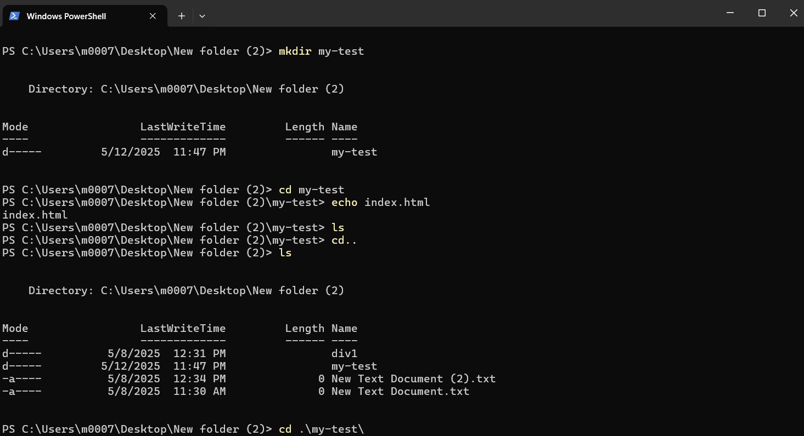

## My Dev Diary

### About Me
Hi! My name is **Mohammad Yaseen**, a computer science graduate from *Al-Hussein Bin Talal University* with a **Very Good** GPA.  
I have learned the **Laravel** PHP framework, and now I’m focusing on improving my skills in **GitHub** and **JavaScript**.  
Currently, I’m studying at **Luminus College** in Jordan, and I’m very excited and motivated to keep growing and developing as a programmer.

---

### What I learned from *Good Developer Mindset*
- **Learning continuously** is essential in software development.
- *Debugging* is part of the process, not a failure.
- Always stay curious and open to new ideas.
- Being consistent and having the right mindset leads to long-term growth.

---

### What I learned from *Terminal Command Cheat Sheet*
Here are the terminal commands I practiced, along with what they do:

| Command | Description |
|--------|-------------|
| `pwd` | Prints the current directory path (where you are). |
| `ls` | Lists all files and folders in the current directory. |
| `cd folder-name` | Changes directory into the specified folder. |
| `cd ..` | Goes back one level to the parent directory. |
| `mkdir folder-name` | Creates a new directory (folder). |
| `echo file-name` | Creates a new empty file. |
| `rm file-name` | Removes (deletes) a file. |
| `rm -r folder-name` | Removes a folder and all its contents. |
| `clear` | Clears the terminal screen. |
| `code .` | Opens the current folder in Visual Studio Code (if configured). |

These commands help me work faster and more efficiently by controlling my projects through the terminal.

---

### My Markdown Practice
Here’s how I used different Markdown formats:

- **Bold text** for important points
- *Italic text* for emphasis
- `Code formatting` for commands and code
- Lists to organize my ideas